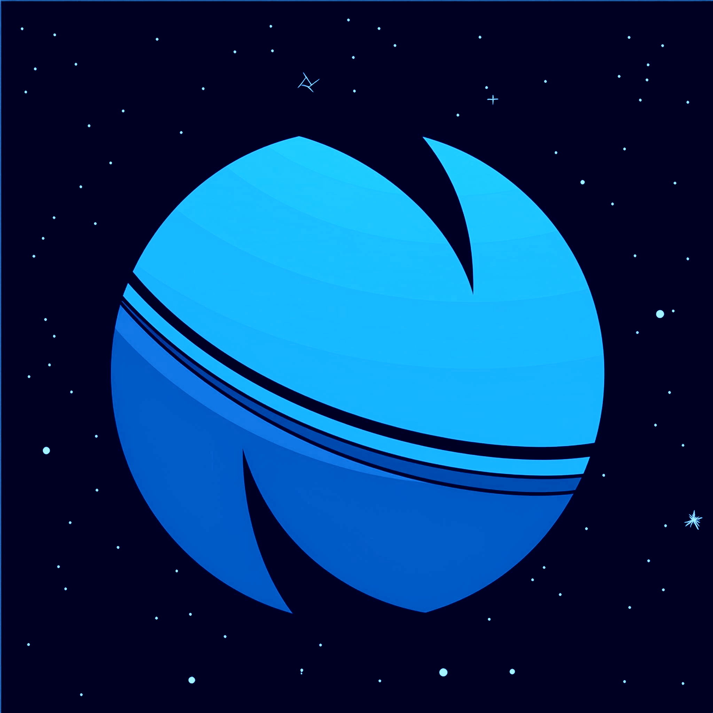
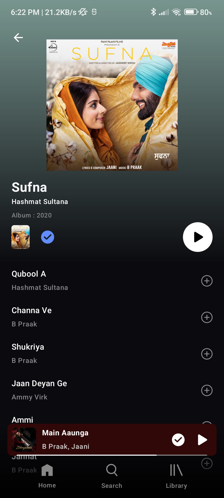
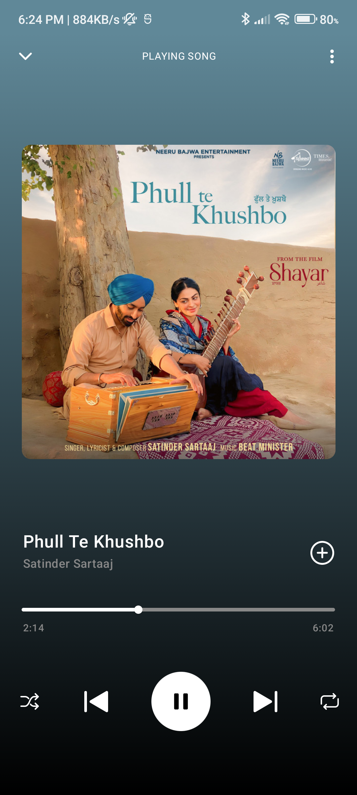
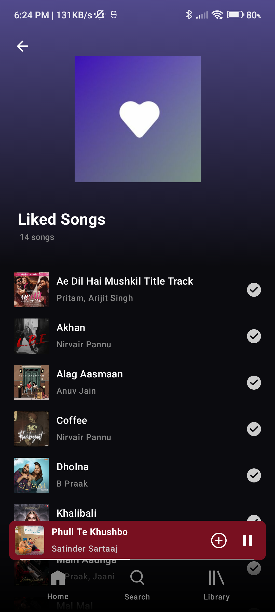
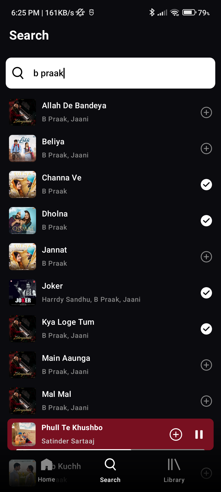
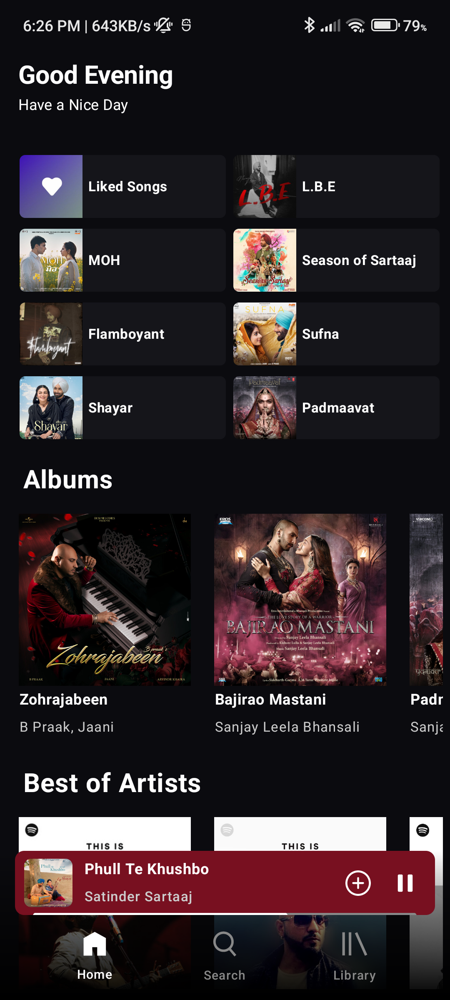
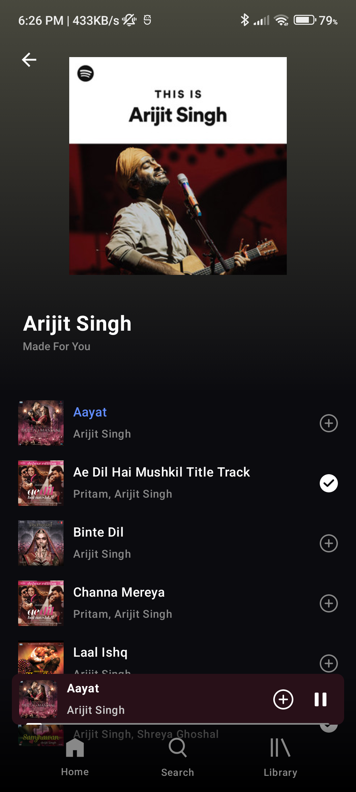

  
  <h3 align="center">Music Stream Neptune</h3>

  Music Stream Neptune is a music streaming application developed in Kotlin. The application allows users to play, pause, shuffle, and repeat songs. It also provides a feature to like songs and maintain a list of liked songs.

## Screenshots

  
  
  
  
  
  

## Tools and Libraries Used

- Language: Kotlin
- Framework: Android Jetpack Compose
- Image Loading: Glide
- Dependency Injection: Hilt
- Asynchronous Programming: Coroutines
- Android Architecture Components: ViewModel, LiveData

## Setup and Installation

1. Clone the repository: `git clone https://github.com/Navneet852/MusicStreamNeptune.git`
2. Open the project in Android Studio Jellyfish | 2023.3.1 Patch 2
3. Build and run the project on an emulator or actual device

## Contributing

Pull requests are welcome. For major changes, please open an issue first to discuss what you would like to change.# music-player-compose
